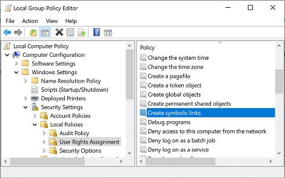

>/ [VST Home](../../index.md) / [Frequently Asked Questions](../FAQ/Index.md)
>
># Miscellaneous

[[_TOC_]]

---

## Q: How is a normalized value converted to a discrete integer value in VST 3?

A detailed description of parameter handling is provided here: [**Parameters**](../Technical+Documentation/Parameters+Automation/Index.md).

## Q: What is the return value tresult?

Almost all **VST 3** interfaces return a *tresult* value. This integer value allows to return to the caller more differentiated error/success information than just a boolean value with its true and false.

The various possible values are defined in *funknown.h*. They are the same values as used in COM. Be careful when checking a *tresult* return value, because on success **kResultOk** is returned which has the integer value *0*:

``` c++
// this is WRONG!!!!!
if (component->setActive (true))
{
}
 
// this is CORRECT!!!!!
if (component->setActive (true) == kResultOK)
{
}
// or
// this is CORRECT too!!!!!
if (component->setActive (true) != kResultOK)
{
    // error message....
}
```

## Q: Which version of Steinberg Sequencers support VST 3?

In order to load **VST 3 plug-ins** you need at least :

- For VST 3.0.0 **Cubase**/**Nuendo** 4.1.2 is needed.
- For VST 3.0.1 features **Cubase** 4.2 is needed.
- For VST 3.5.0 features **Cubase** 6.0 is needed.
- see [other VST 3 Hosts](../What+is+VST/Use+cases.md#examples-of-vst-3-host-applications)

## Q: Why do plug-ins need subcategories?
When you export your plug-in in the factory instance (check *againentry.cpp*: DEF_CLASS2), you have to define a subcategory string (can be a combination of more than one string: like "**Fx|Dynamics|EQ**" for example).

Currently the subcategory string is used by **Cubase**/**Nuendo** to organize the plug-ins menu like this:

``` c++
/* Computation of Folder Name (SubCategories => folder in menu) */
      "Fx"                        => "Other"
      "Fx|Delay"                  => "Delay"
      "Fx|Mastering|Delay"        => "Mastering"
      "Spatial|Fx"                => "Spatial"
      "Fx|Spatial"                => "Spatial"
      "Instrument|Fx"             => if used as VSTi "" else if used as Insert "Other"
      "Instrument|Sampler"        => "Sampler"
      "Fx|Mastering|Surround"     => "Mastering\Surround"
      "Fx|Mastering|Delay|Stereo" => "Mastering\Stereo"
      "Fx|Mastering|Mono"         => "Mastering\Mono"
```

This string should only be a hint what type of plug-in it is. It's not possible to define all types. If you have wishes for new categories, please discuss them in the VST [Developer Forum](../Forum/Index.html) (<https://sdk.steinberg.net>) and we can add them to future versions of the SDK.

## Q: Is it possible to define a plug-in as Fx and Instrument?

Yes it is possible, you can use the CString [kFxInstrument](https://steinbergmedia.github.io/vst3_doc/vstinterfaces/group__plugType.html#gabe030351fd22d14dad35c817e1849f59) ("Fx|Instrument") as subcategories (check DEF_CLASS2). In this case Steinberg Sequencers will allow the user to load it as an effect and as an instrument. The plug-in as instrument (in case of current Steinberg Sequencers <= 5.5) will not enable the Audio Input busses.

## Q: Is it possible to ask a plug-in about which speaker arrangements are supported?

No, not before the plug-in is instantiated, there is no way to ask the factory about which arrangements are supported for a given plug-in. The host can instantiate the plug-in and before start processing then set some different speaker Arrangements and check if the plug-in supports them.

## Q: Which version of Steinberg Sequencers support [VST 3 Note Expression](../Technical+Documentation/Change+History/3.5.0/INoteExpressionController.md)?

In order to use Note Expression with **VST 3 plug-ins** you need at least Cubase/Nuendo 6.0.

## Q: When compiling for Mac AudioUnit, I have a compiler error in AUCarbonViewBase.cpp. What can I do?

Due to an issue in the Mac CoreAudio SDK, not yet fixed by Apple, you have to apply a small patch to the file AUCarbonViewBase.cpp (located in CoreAudio/AudioUnits/AUPublic/AUCarbonViewBase):\
=> Change:

``` c++
HISize originalSize = { mBottomRight.h, mBottomRight.v };
to
HISize originalSize = { static_cast<CGFloat>(mBottomRight.h),
                        static_cast<CGFloat>(mBottomRight.v) };
```

## Q: How can I develop a SurroundPanner plug-in which is integrated in Nuendo as Panner?

In order to make a surroundPanner plug-in selectable as panner (Post-fader) in Nuendo, this plug-in should have as subCategories: [kSpatial](https://steinbergmedia.github.io/vst3_doc/vstinterfaces/group__plugType.html#gaa334568999d986b4e50627646e51a8b4) or [kSpatialFx](https://steinbergmedia.github.io/vst3_doc/vstinterfaces/group__plugType.html#ga9439d03e5e14fb7a35976d2e37f34e31) (in order to use it as insert too). For example:

``` c++
DEF_CLASS2 (INLINE_UID_FROM_FUID(Steinberg::Vst::SPannerProcessor::cid),
            PClassInfo::kManyInstances,
            kVstAudioEffectClass,
            stringPluginName,
            Vst::kDistributable,
            Vst::PlugType::kSpatial ,
            FULL_VERSION_STR, // plug-in version (to be changed)
            kVstVersionString,
            Steinberg::Vst::SPannerProcessor::createInstance)
```

Be sure that you overwrite the function "tresult PLUGIN_API setBusArrangements ..." which allows you to get the current bus arrangements.

## Q: How can I validate my plug-in?

You have the Validator command line which can be automatically called after you compile your plug-in (when you use the cmake defined by the SDK). This will apply some standard validations. The 2cd validation tool is the [VST 3 plug-in Test Host](../What+is+the+VST+3+SDK/Plug-in+Test+Host.md): check its menu entry: View => Open plug-in Unit Tests Window

## Q: How can I allow to create Symbolic Link on Windows?

In order to be able to create Symbolic Link on Windows you have to set the correct group policy, this will allow you to build the **VST 3** plug-ins and create a symbolic link (cmake option SMTG_CREATE_PLUGIN_LINK) for each plug-in into the folder C:\Program Files\Common Files\VST3. For this you have to start the "Edit group policy" from the Windows Search (Windows icon):
>gpedit.msc

Navigate to\
*Computer configuration => Windows Settings => Security Settings => Local Policies => User Rights Assignment => Create symbolic links*

Here you can set which users can create symbolic links:


