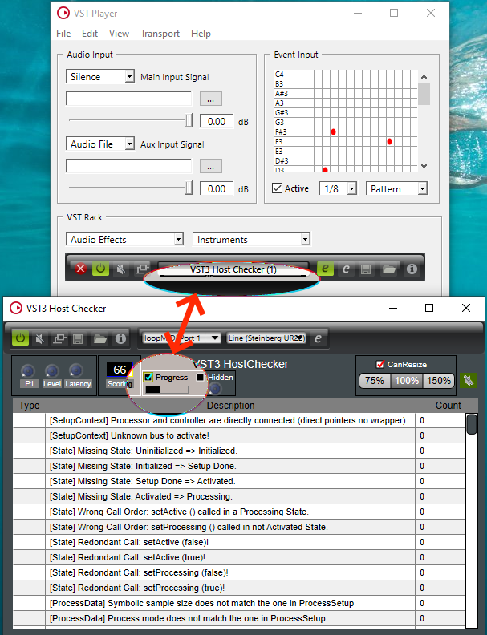

>/ [VST Home](../../../) / [Technical Documentation](../../Index.md)
>
># [3.7.0] Progress display

**On this page:**

[[_TOC_]]

---

## Introduction

Extended host callback interface for an edit controller: [Vst::IProgress](https://steinbergmedia.github.io/vst3_doc/vstinterfaces//classSteinberg_1_1Vst_1_1IProgress.html)

- [host imp]
- [extends [IComponentHandler](https://steinbergmedia.github.io/vst3_doc/vstinterfaces/classSteinberg_1_1Vst_1_1IComponentHandler.html)]
- [released: 3.7.0]
- [optional]

Allows the plug-in to request the host to create a progress for some specific tasks which take some time. The host can visualize the progress as read-only UI elements. For example, after loading a project where a plug-in needs to load extra data (e.g. samples) in a background thread, this enables the host to get and visualize the current status of the loading progress and to inform the user when the loading is finished. Note: During the progress, the host can unload the plug-in at any time. Make sure that the plug-in supports this use case.

## Examples

### How to call it from the plug-in side

``` c++
//--------------------------------------
// we are in the editcontroller:
// as member: IProgress::ID mProgressID;
  
FUnknownPtr<IProgress> progress (componentHandler);
if (progress)
    progress->start (IProgress::ProgressType::UIBackgroundTask, STR ("Load Samples..."), mProgressID);
  
// ...
myProgressValue += incProgressStep;
FUnknownPtr<IProgress> progress (componentHandler);
if (progress)
    progress->update (mProgressID, myProgressValue);
  
// ...
FUnknownPtr<IProgress> progress (componentHandler);
if (progress)
    progress->finish (mProgressID);
```

[VST 3 Plug-in Test Host](../../../What+is+the+VST+3+SDK/Plug-in+Test+Host.md) integration of [Vst::IProgress](https://steinbergmedia.github.io/vst3_doc/vstinterfaces//classSteinberg_1_1Vst_1_1IProgress.html)


