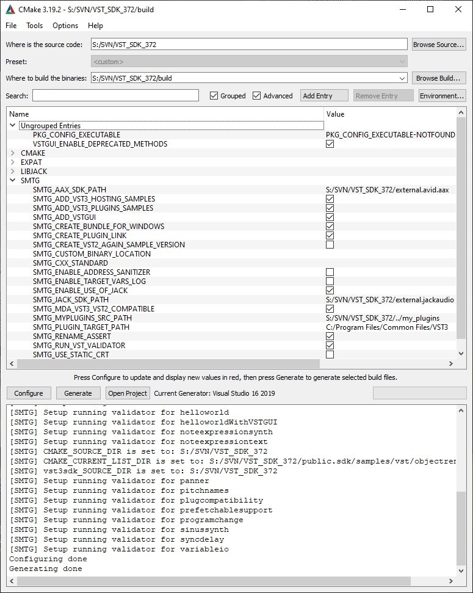

>/ [VST Home](../) / [Tutorials](../Tutorials/Index.md)
>
># Using cmake for building VST 3 plug-ins

**On this page:**

[[_TOC_]]

**Related pages:**

- [How to set up my system for VST 3](../Getting+Started/How+to+setup+my+system.md)
- [Building the examples included in the SDK](../Tutorials/Building+the+examples+included+in+the+SDK.md)

---

This tutorial explains how to use *cmake* with **VST 3 SDK**.

## CMake for building VST 3 plug-ins

The SDK provides a set of cmake files allowing you to compile the included samples and to develop new plug-ins.

- Download cmake from: <https://cmake.org> or use a package manager for your OS (See [How to set up my system for VST 3](../Getting+Started/How+to+setup+my+system.md)).
- You can use the command line or the cmake editor ([cmake-gui](https://cmake.org/download/)).

## Command line for Windows

Example for building "**Microsoft Studio 16 2019**" solution:

```
// go in to the folder where you extracted the VST 3 SDK
mkdir build
cd build
cmake.exe -G "Visual Studio 16 2019" -A x64 "..\vst3sdk"
//  or without symbolic links
cmake.exe -G "Visual Studio 16 2019" -A x64 "..\vst3sdk" -DSMTG_CREATE_PLUGIN_LINK=0

//  or with symbolic links but using the user location (does not request admin right)
cmake.exe -G "Visual Studio 16 2019" -A x64 "..\vst3sdk" -DSMTG_PLUGIN_TARGET_USER_PROGRAM_FILES_COMMON=1

// note: you can find the string definition for differentVisual Studio Generators in the cmake online documentation
```

## Command line for macOS

 Example for building **Xcode** project:

```
// go in to the folder where you extracted the VST 3 SDK
mkdir build
cd build
/Applications/CMake.app/Content/bin/cmake -G"Xcode" "..vst3sdk"
```

## On Linux with QtCreator

You can use **QtCreator** 2.3.1 (or higher)

```
start QtCreator 2.3.2
open the CMakeLists.txt located at the top of the VST 3 SDKfolder
click on the menu Build->Run CMake
```

## Use of cmake-gui

```
start the CMake (cmake-gui) application
set "Where is the source code" to the location of the"VST3_SDK" folder
set "Where to build the binaries" to a build folder of yourchoice
click on "Configure"
click on "Generate" for creating project/solution
```



Example of cmakegui application on Windows

- Compile with cmake command line

``` c++
cd build
cmake --build
```

- Choose a specific compiler with cmake (command line on Linux)

``` c++
cmake -DCMAKE_C_COMPILER=/usr/bin/clang-DCMAKE_CXX_COMPILER=/usr/bin/clang++

or

cmake -DCMAKE_C_COMPILER=/usr/bin/gcc-DCMAKE_CXX_COMPILER=/usr/bin/g++
```

## Available SMTG cmake options

- **SMTG_AAX_SDK_PATH**: Here you can define where the AAX SDK is located (if needed)
- **SMTG_ADD_VST3_HOSTING_SAMPLES**: Add VST 3 hosting samples to the solution (default ON)
- **SMTG_ADD_VST3_PLUGINS_SAMPLES**: Add VST 3 plug-in samples to the project (default ON)
- **SMTG_ADD_VSTGUI**: Add VSTGUI support (default ON)
- **SMTG_BUILD_UNIVERSAL_BINARY**: Build universal binary (32 & 64 bit) (Mac only)
- **SMTG_COREAUDIO_SDK_PATH**: Here you can define where the COREAUDIO SDK is located (Mac only, if needed)
- **SMTG_CREATE_BUNDLE_FOR_WINDOWS**: Create bundle on Windows for the VST 3 plug-ins (new since 3.6.10! Windows only) (default ON)
- **SMTG_CREATE_PLUGIN_LINK**: Create symbolic link for each VST 3 plug-in in ${VST3_FOLDER_NAME} folder (you need to have Administrator rights on Windows or change the Local Group Policy to allow the creation of symbolic links) (default ON)
- **SMTG_CREATE_VST2_AGAIN_SAMPLE_VERSION**: Allows you to create the VST 2 version of the Sample Plug-in AGain, be sure that you have copied the VST 2 interfaces into the folder VST_SDK/VST3_SDK/pluginterfaces/vst2.x (default OFF)
- **SMTG_CUSTOM_BINARY_LOCATION**: Customize output location for binaries
- **SMTG_CXX_STANDARD**: C++ standard version used for plugins: 14, 17, 20
- **SMTG_ENABLE_ADDRESS_SANITIZER**: Enable Address Sanitizer
- **SMTG_ENABLE_TARGET_VARS_LOG**: Enables to log target variables for debugging (new since 3.6.11!) (default OFF)
- **SMTG_ENABLE_USE_OF_JACK**: Allows you to create the audiohost application using Jack (default OFF)
- **SMTG_MDA_VST3_VST2_COMPATIBLE**: Build the MDA examples as a replacement for their VST 2 counterpart (default ON)
- **SMTG_IOS_DEVELOPMENT_TEAM**: Needed for building the InterAppAudio and AUv3 examples for iOS (Mac only)
- **SMTG_MYPLUGINS_SRC_PATH**: Here you can add your VST 3 plug-ins folder
- **SMTG_PLUGIN_TARGET_PATH**: Here you can redefine the VST 3 plug-ins folder
- **SMTG_PLUGIN_TARGET_USER_PROGRAM_FILES_COMMON**: use FOLDERID_UserProgramFilesCommon as VST 3 target path (Windows only) (default OFF)
- **SMTG_RENAME_ASSERT**: Rename ASSERT to SMTG_ASSERT to avoid conflicts with 3rd party libraries (default ON)
- **SMTG_RUN_VST_VALIDATOR**: Run the VST validator on VST 3 plug-ins each time they are built (default ON)
- **SMTG_USE_STATIC_CRT**: Use static CRuntime on Windows (option /MT) (default OFF) (Windows only)

>**Preparation on Windows**
>
>---
>
>Generated VST 3 Microsoft Visual Studio Projects using the [cmake](https://cmake.org/) included in the SDK will create by default symbolic links for each built plug-in in the [official VST 3 folder](../Technical+Documentation/Locations+Format/Plugin+Locations.md), in order to allow this on Windows you have to adapt the Group Policy of Windows. See [Here](../Getting+Started/Preparation+on+Windows.md)!
>
>If you do not want to create this link, call [cmake](https://cmake.org/) with this parameter:
>
>``` c++
>-DSMTG_CREATE_PLUGIN_LINK=0
>```
>
>You could choose the [new user location](../Technical+Documentation/Locations+Format/Plugin+Locations.md) for VST 3 plug-ins, call [cmake](https://cmake.org/) with this parameter:
>
>``` c++
>-DSMTG_PLUGIN_TARGET_USER_PROGRAM_FILES_COMMON=1`
>```

## Using your IDE for compiling the examples

- Solution/project (vstsdk.sln/vstsdk.xcodeproj) is generated in the *"build"* folder.
- The created plug-ins are located in the *"build"* folder, in sub-folders ***/VST3/Release*** or ***/VST3/Debug***.
- In order to allow a DAW to find these plug-ins you have to create links from the official [VST 3 Locations](../Technical+Documentation/Locations+Format/Index.html) to them.
