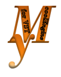
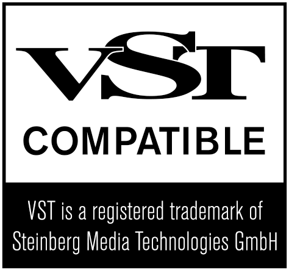
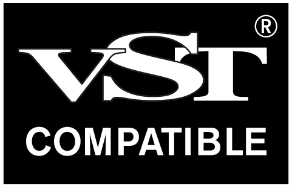
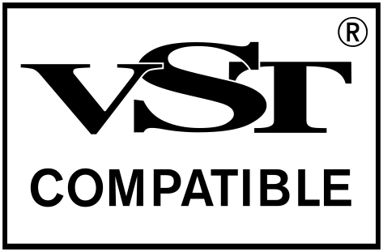

>/ [VST Home](../index.md) / [VST 3 Licensing](../VST+3+Licensing/Index.md)
>
># Steinberg VST usage guidelines

**On this page:**

[[_TOC_]]

**Related pages:**

- [VST 3 Licensing](../VST+3+Licensing/Index.md)
- [What are the licensing options for VST 3?](../VST+3+Licensing/What+are+the+licensing+options.md)
- [Developer use cases (FAQs)](../VST+3+Licensing/Developer+use+cases.md)

---

Whenever **VST**® is used or the SDK has been used to create a product or the SDK is included (Open-source [GPLv3](https://www.gnu.org/licenses/gpl-3.0.en.html) case), it is required to add the reference to [Steinberg](https://www.steinberg.net/) by using the **VST compatible logo** as supplied by [Steinberg](https://www.steinberg.net/). Included in the VST SDK, the **VST compatible logo** can be found in the folder *VST_SDK/VST3_SDK/vst3_doc/artwork*.

This logo exists in different forms: with and without the trademark text, black on white and white on black. If you choose the logo without the trademark text, you have to include the following statement somewhere:

>**"VST is a trademark of Steinberg Media Technologies GmbH, registered in Europe and other countries."**

## 1. Required use of VST Compatible logo

Whenever “**VST**” is used, or the SDK is used to create a product, or when the SDK is included, it is required to add the reference to Steinberg by using the “**VST Compatible logo**” as supplied by Steinberg on each of the following:

1. on package

2. on website:\
The **VST Compatible logo** must be shown on every webpage that relates to such a product or shows **VST**. Using e.g. only within the imprint is NOT sufficient.

3. all documentation, regardless of the media used, such as PDF manuals, website, printed manuals etc.

On each of the following the logo can be omitted only if not enough space is available. However, in such a case be sure to include Steinberg's copyrights notice:

1. on all advertising materials

2. in the "about box" or similar (e.g. help menu, startup screen) of the product.

## 2. Use of VST unrelated to the VST Compatible logo

It is allowed for all parties that have entered into the current Steinberg **VST** Plug-in SDK Licensing Agreement to use “**VST**” in regular letters to refer to compatibility as long as complying with the Agreement. This can be done on the package/website or even within the name of the product as long as the form of use is in line with the Agreement and the **VST Compatible logo** is always shown in the context of such. The following shall provide more guidance related to common forms of usage.

## 3. Use when claiming compatibility

It is allowed to use claims such as “**compatible with 64-bit VST**” if the **VST Compatible logo** is placed in context of such claim, e.g. not too far away on the same page, and the product uses or has been created using the SDK and is, in fact, compatible.

## 4. Use on website

It is not sufficient to include the **VST Compatible logo** only in the imprint or one other page. All pages that relate to a product using or created using the SDK or showing VST must show the **VST Compatible logo**.

## 5. Use on package

The **VST Compatible logo** must be printed on the package of any product using or created using the SDK or showing **VST**.

## 6. Use in product name or logo

Provided that the **VST Compatible logo** is always displayed in the context of such a product name, “**VST**” may be added to the basic product name, e.g. like “mycoolEngine for **VST**”, if set in regular type and not graphically illustrated or integrated into the product name, and if the **VST Compatible logo** is always shown in direct context to such a product name. It is not allowed to merge the basic product name and **VST** in any graphical way into one integrated visual. E.g., it is allowed to use like this:

while it is unacceptable to use it like this:

## 7. Use in company name

It is not allowed to include **VST** in the company name.

## 8. Use in social media

It is allowed to use **VST** in channels and their names/URLs and the like, if a junction is used to denote the compatibility, e.g. in “MycoolEngineForVST”, and if the channels etc. always show the **VST Compatible logo**.

## 9. Use in domain

It is allowed to use **VST** in domains, e.g. second level domains, if a junction is used to denote the compatibility, e.g. in *“MycoolEngineForVST.com”*, and if any page under such domain shows the **VST Compatible logo** and the domain only shows products using or created using the SDK.

## 10. Use in logo

It is not permitted to include **VST** in a company logo but it is allowed to include **VST** in a product logo provided that is in conformity with No. 6 (Use in product name or logo).

## 11. Use in video

It is allowed to use “**VST**” in the title of a video or in a video, e.g. a tutorial, in a way as named above, e.g. as an addition to a product name or to show the compatibility, if the **VST Compatible logo** is shown in the video and, if **VST** is included in the title of the video, on any page that shows the video and/or the title. Provided that a frame of the video is shown as still (e.g. when presenting the video while not playing it) and such frame includes **VST**, the frame or the direct context of the video needs to show the **VST Compatible logo**.

## 12. Use in category

It is allowed to use **VST** in a category or in a related URL outside of the domain, e.g. in [www.myreviews.com/VSTplugins/](http://www.myreviews.com/VSTplugins/), if such category is of generic meaning, and if under such category only forms of use and/or products in line with the SDK agreement are listed.

## 13. Use in combination or composition

It is not allowed to create combinations or compositions like “**VSTi**” or similar.

## 14. VST Compatible logo

The current **VST Compatible logos** are the following:

>
>

Minimum printing size = 20 x 18,7 mm

>
>

Minimum printing size = 15 x 10 mm

## 15. General guidelines for using VST trademark

On product documentation and promotional materials, use the registered trademark symbol (®) the first time the VST trademark appears in the text. Also include an attribution of Steinberg's ownership within the credit notice.
Attribution:

>**"VST® is a trademark of Steinberg Media Technologies GmbH, registered in Europe and other countries."**

## 16. Questions and suggestions

Questions and suggestions regarding this guide can be sent to <reception@steinberg.de>
