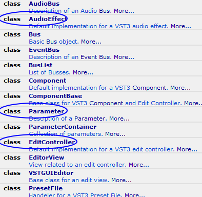
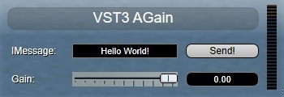
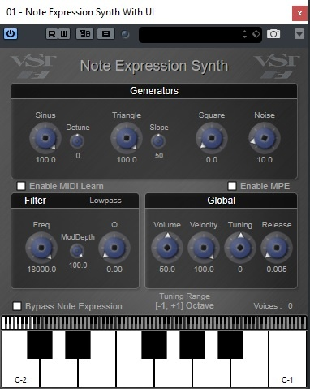
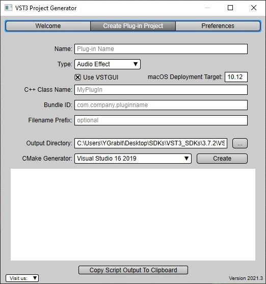

>/ [VST Home](../)
>
># What is the VST 3 SDK?

**On this page:**

[[_TOC_]]

---

## VST 3 SDK explained

The **VST 3 SDK** (Virtual Studio Technology Software Development Kit) is a collection of software development tools included in one package. This allows plug-in developers to create plug-ins in **VST 3** format and host developers to load **VST 3** plug-ins into a DAW or audio editor.

## What is included

The **VST 3 SDK** package contains:

>**The VST 3 API**\
>This is a **C++ interface** defining how a **VST 3** plug-in communicates with a host and vice versa. The heart of **VST 3**.
>
>Check the folder *"pluginterfaces/vst"* of the SDK!

>**VST 3 Implementation Helper Classes**\
>Some helper classes are provided, implementing some **VST 3** interfaces for hosting and for creating **VST 3** plug-ins. Simply derived your plug-in C++ classes from these helper classes.
>
>
>
>Check the folder *"public.sdk"* of the SDK!

## [AAX, AUv3, AU and VST 2 wrappers](../What+is+the+VST+3+SDK/Wrappers/Index.md)

These wrappers allows you to create versions of your **VST 3** plug-in in other plug-in formats with minimum effort:
- **[AAX](http://apps.avid.com/aax-portal/)** format used by Pro Tools®
- **[AUv3](https://developer.apple.com/documentation/audiotoolbox)** and **AU** (Audio Unit) on Apple platform
- **VST 2** (deprecated)

Check the folder *"public.sdk/source/vst/aaxwrapper"* of the SDK!

## [VST 3 Plug-ins Examples](../What+is+the+VST+3+SDK/Plug-in+Examples.md)

The SDK includes some Plug-ins implementation examples. The Legendary **AGain** and **ADelay**, thanks Paul Kellet the Open-source **mda** Plug-ins, a basic "Note Expression Synth" supporting "**Note Expression Event**", an example of **pitchnames** support Plug-in, a **VST 3 Host Checker** which checks if a host is VST 3 compliant and more...

>
>
>
>
>
>
>

Check the folder *"public.sdk/samples/vst"* of the SDK!

## [VST 3 Plug-in Test Host](../What+is+the+VST+3+SDK/Plug-in+Test+Host.md)

The SDK provides a test application called **VST3PluginTestHost** for Apple Mac OS X (i386/x86_64) and Microsoft Windows (32bits, 64bits).\
This application allows you to load a plug-in, simulates some inputs (Audio and Event) and acts like a small **VST 3** host application based on an **ASIO** driver.\
Included in this application is a test module which allows you to check your plug-in in regard to the **VST 3** standard.

Check the folder *"bin"* of the SDK!

## Validator command line

>**as Cross-platform source code**\
>The ***validator*** is a small command line host application (source code included) which can be used to check your > plug-in for VST 3 conformity. You can also write your own test code and let the **validator** execute it. Very nice for > automatic build server integration.
>
>Check the folder *"public.sdk/samples/vst-hosting/validator"* of the SDK!

## AudioHost

>**as Cross-platform source code**\
>Simple cross-platform (only tested on Linux) host application allowing you to register a VST 3 plug-in with Jack Server. First, you have to download the Jack Audio SDK and application server (<http://www.jackaudio.org>).\
>- Windows (not tested): audiohost.exe "C:\PATH_TO_PLUGIN"
>- macOS (not tested)
>- Linux: audiohost PATH_TO_PLUGIN
>
>On Windows and macOS, you can also drag and drop a **VST 3 plug-in** on the executable via Explorer/Finder.
>
>Check the folder *"public.sdk/samples/vst-hosting/audiohost"* of the SDK!

## EditorHost

>**as Cross-platform source code**\
>Simple cross-platform (Win/macOS/Linux) host application allowing you to open the editor of a VST 3 plug-in (with HiDPI > support on Windows/macOS). Call it from the command line: Windows: editorhost.exe "C:\PATH_TO_PLUGIN" macOS/Linux: > editorhost PATH_TO_PLUGIN
>
>On Windows and macOS you can also drag and drop a **VST 3 plug-in** on the executable via Explorer/Finder.
>
>Check the folder *"public.sdk/samples/vst-hosting/editorhost"* of the SDK!

## VST 3 Inspector

>**as Cross-platform source code**\
>Simple cross-platform (Win/macOS/Linux) host application, built with VSTGUI, which scans the VST 3 Folder, collects > information from the factory about each VST 3 plug-in and display it in its UI.
>
>
>
>Check the folder *"public.sdk/samples/vst-hosting/inspectorapp"* of the SDK!

## [VSTGUI](../What+is+the+VST+3+SDK/VSTGUI.md)

This is a user interface toolkit mainly for audio plug-ins (VST, AudioUnit, etc). Based on the XML definition of the plug-in UI, **VSTGUI** includes an embedded editor (UIDescription Editor) which allows the developer to create a plug-in UI just by drag & drop of the UI element.

First developed in-house by Steinberg Media Technologies (around 1998) for their first VST plug-ins. Later added as binary libraries to the official **VST SDK**. Since May 2003, **VSTGUI** is open source, and is hosted now at GitHub <https://github.com/steinbergmedia/vstgui>.

The last official release version of **VSTGUI** is always included in the **VST 3 SDK**.

Example of the **VSTGUI** UIDescription Editor (embedded editing WYSIWYG)

Check the folder *"vstgui4"* of the SDK!

## [VST 3 Project Generator](../What+is+the+VST+3+SDK/Project+Generator.md)

This open source application (Win/macOS) allows you to generate easily a new **VST 3** plug-in project by just entering in a GUI some parameters.

Check the folder "VST3_Project_Generator" of the SDK!

The source code is available at [GitHub - steinbergmedia/vst3projectgenerator: VST 3 Project Generator](https://github.com/steinbergmedia/vst3projectgenerator).

## [iOS Inter-App Audio support](../What+is+the+VST+3+SDK/iOS+Inter-App+Audio+support.md)

iOS InterApp-Audio application out of your **VST 3 plug-in**

## [VST 3 Licensing](../VST+3+Licensing/Index.md)

>**Steinberg VST 3 Plug-In SDK Licensing Agreement**\
>Please sign this **License Agreement** if you want to develop, release or host **VST 3** plug-Ins.

## System requirements

| Operating System                  | Architecture                  | Compiler              | Notes                             |
| --------------------------------- | ----------------------------- | --------------------- | --------------------------------- |
| Windows 10                        | x86, x86_64                   | MSVC 2019, MSVC 2022  |                                   |
| Windows 8.1                       | x86, x86_64                   | MSVC 2019, MSVC 2022  |                                   |
| macOS 10.13 - 12                  | x86, x86_64, Apple Silicon    | Xcode 10 - 13.3       |                                   |
| iOS 13 - 15                       | arm64                         | Xcode 11 - 13.3       |                                   |
| Linux - Raspberry Pi OS (Buster)  | arm32                         | GCC 8.3 and higher    | Visual Studio Code                |
| Linux - Ubuntu 22.04 LTS          | x86, x86_64                   | GCC 11.2 and higher   | Visual Studio Code, Qt Creator    |
| Linux - Ubuntu 20.04 LTS          | x86, x86_64                   | GCC 8.3 and higher    | Visual Studio Code, Qt Creator    |

## [Download link](../Getting+Started/Links.md)

Important links you will need for working with **VST 3**

## [Change history](../Technical+Documentation/Change+History/Index.md)

All released versions of the **VST 3 SDK** with changes and dates.
