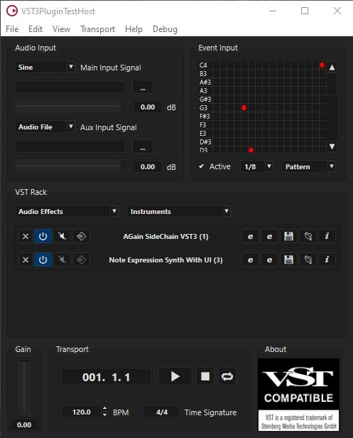
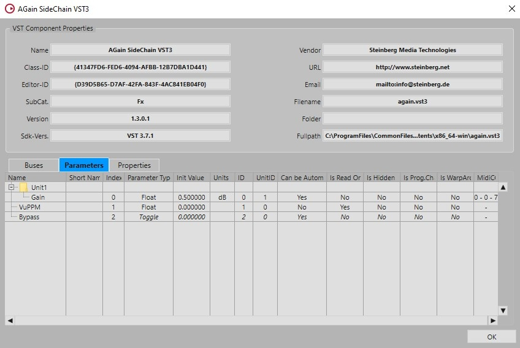
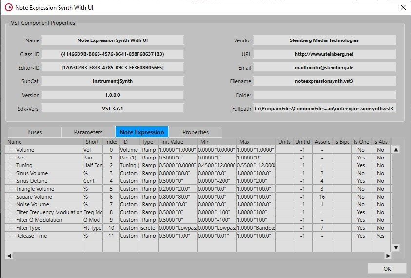
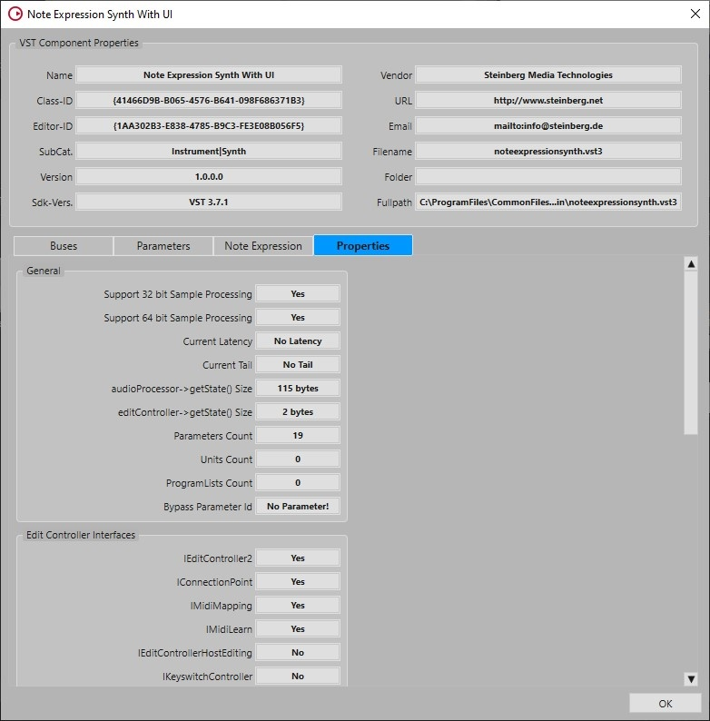
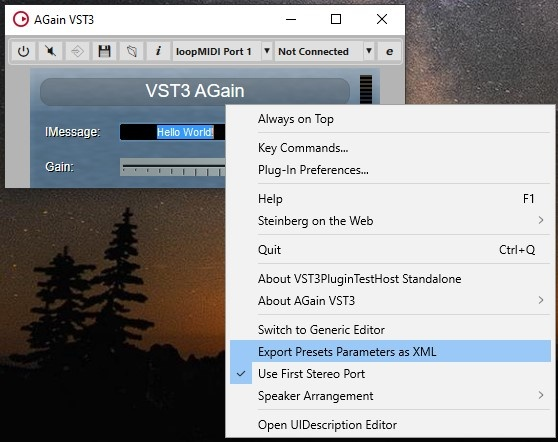
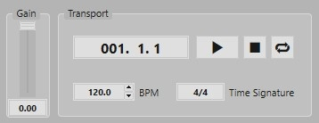
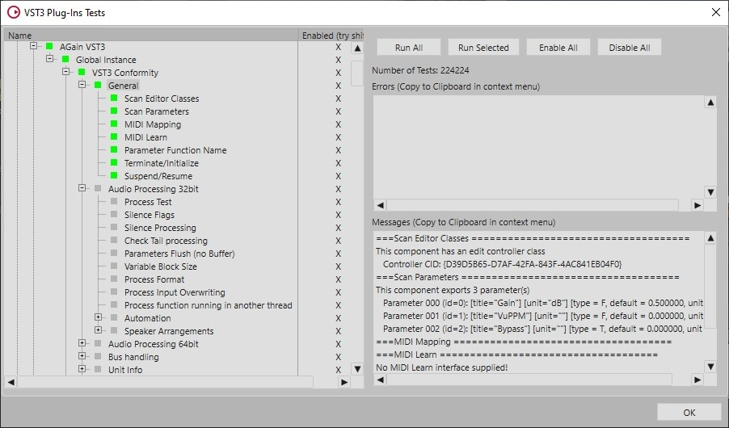

>/ [VST Home](../Index.md) / [What is the VST 3 SDK?](../What+is+the+VST+3+SDK/Index.md)
>
># VST 3 Plug-in Test Host

**On this page:**

[[_TOC_]]

**Related pages:**

- [VST 3 Plug-in Examples](../What+is+the+VST+3+SDK/Plug-in+Examples.md)

---

## Introduction

The SDK provides a test application called **VST3PluginTestHost** for Apple Mac OS X (i386/x86_64) and Microsoft Windows (32bits, 64bits). 
This application allows you to load a plug-in, simulates some inputs (Audio and Event) and acts like a small **VST 3** host application based on an **ASIO** driver. 
Included in this application is a test module which allows you to check your plug-in in regard to the **VST 3** standard.

Check the folder *"bin"* of the SDK!

## How to use it?

- **View -> Open Plug-in Information Window**: opens a window showing all registered component and controller **VST 3 plug-ins**
- **View -> Open Plug-in Unit Tests Window**: opens a window where you can test your plug-in with a series of unit tests.
- **View -> Open Preset Editor**: allows you to open, check and modify **VST 3** presets (adding meta attributes like in Instrument/- Style/Character)
- **File -> Convert VST3 Preset to VST2 preset (fxp or fxb)**: allow to convert **VST 3** Presets to compatible **VST 2** Presets.
- **File -> Overwrite Plug-in Name in VST3 Presets**: allow to rename the plug-in name in a set of **VST 3** Presets.

## VST Player Window

### Audio Input

In this section you can select the audio source of your plug-in for the Main Input Audio Bus and for the Aux Input Audio Bus ([Side-chain](../Technical+Documentation/Change+History/3.0.0/Multiple+Dynamic+IO.html#what-is-a-side-chain): if available) between:
- A sine wave
- Noise
- Silence
- ASIO Input (first stereo)
- An Audio File (in this case use the browser (... button) to choose the file (wave, aiff))

A Volume slider allows you to control the level of the source.

### Event Input

This section simulates note events sent to the plug-in.
- A pattern could be defined and initialized with randomized, chromatic or manual events. (for Chromatic choose the start note in the pattern and select Chromatic in the pop-up menu).
- Active check box: enable/disable the playback of this pattern.
- You can choose different loop stepping for this pattern [1, 1/2, ...1/32]

### VST Rack

This section allows you to load serialized multiple plug-ins. Each plug-in will be loaded in a slot.
- To load a plug-in (Audio or Instrument) click on the associated pop-up menu and select one plug-in.
- To unload a plug-in, click on its associated X button on its slot.

For each loaded plug-in in a slot you can:
- Enable/disable the plug-in with the **On** button.
- Bypass/process the plug-in with the **Byp** button (if available as parameter).
- Enable/disable the [Side-chain](../Technical+Documentation/Change+History/3.0.0/Multiple+Dynamic+IO.html#what-is-a-side-chain) bus with the **Aux** button (available only if the plug-in has input [Side-chain](../Technical+Documentation/Change+History/3.0.0/Multiple+Dynamic+IO.html#what-is-a-side-chain)).
- Open its editor with the **Edit** button.
- Save a Preset with the **Store** button.
- Load a Preset with the **Load** button.
- Open the information page of this plug-in with the **Info** button (see below).

### Info Window

- Information window of AGain plug-in showing the **Parameters** panel:

- Information window of NoteExpressionSynth plug-in showing the **[Note Expression](../Technical+Documentation/Change+History/3.5.0/INoteExpressionController.md)** panel:

- Information window of AGain plug-in showing the **Properties** panel:

### Context Menu

Right click on the opened plug-in opens a context menu which allows to trigger some actions:

- **Switch to Generic Editor**: open the generic editor instead of the one provided by the plug-in.
- **Export Presets Parameters as XML**:  load automatically all available VST 3 Presets for this plug-in and create a readable XML file for each preset including the parameter states.

### Transport

In this section you can:

|• set the gain of the output audio  • control the transport state (Loop/Start/Stop/Rewind)  • change the tempo and signature |  |
| :- | - |

## VST 3 Plug-ins Tests Window

In this window you can select a specific test branch for a specific plug-in. You can navigate in the test tree (left part), then click on the button **Run Selected** to process only the selected tests.

There are 2 kinds of tests concerning the way the plug-in is instantiated:
- Global Instance: only one instance of the plug-in will be instantiated for all tests.
- Local Instances: for each test a new instance of the plug-in will be instantiated.

We define currently 2 sets of test:
- VST 3 Conformity
- Special Features

You can run all available tests with **Run All**. It is possible also to disable some tests with the check box in the left view.

Error reports will be displayed in the **Errors view**. In the **Messages View** some warnings (or some plug-in limitations), test results and progress are displayed.

In this version of this Plug-in Test Host, the tests are limited to the main **VST 3** features, in future version the test coverage will be extended.

## Preset Editor

![what_if_23]../..rces/what_is_23.jpg)

With this editor you can load and modify VST 3 presets created with the **Store** button of the VST Rack by adding some meta-attributes.